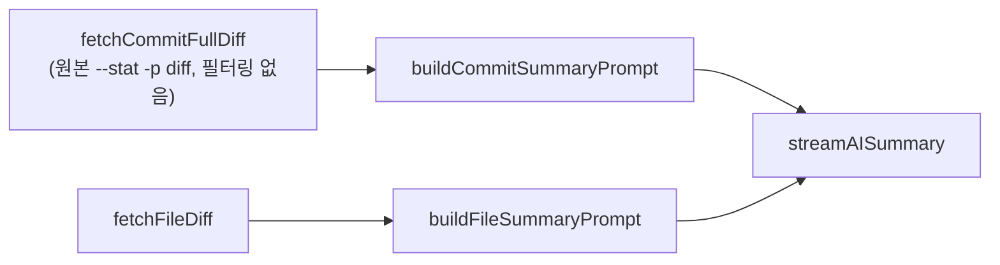
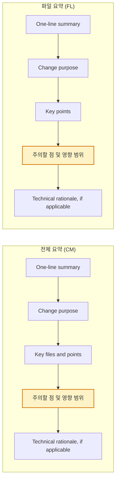
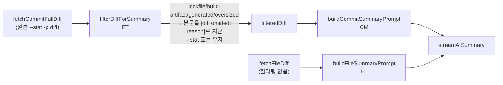
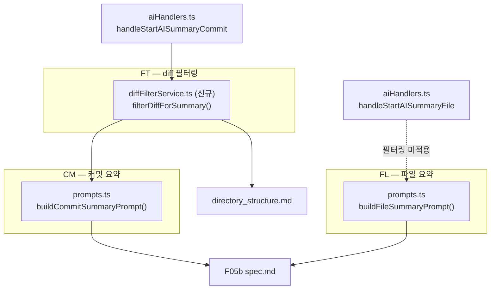

# Plan: F05b AI 요약 프롬프트 최적화 (diff 필터링 + 주의할 점 카테고리)

> 이 문서는 임시 계획서다. 구현 완료 후 변경된 내용만 관련 spec/blueprint/project/core 문서에 반영하고 이 파일은 폐기한다. ([문서 작성 가이드](../project/documentation_guidelines.md) 참고)
>
> 이 파일은 완료 전까지 유일한 정본(single source of truth)이다. 다른 세션에서 이어받을 때는 이 문서 전체를 먼저 읽고, 상태와 체크박스만 보고 무엇이 끝났고 무엇이 남았는지 판단한다 — 별도 진행 상황 문서를 만들지 않는다.

## 상태

| 항목 | 값 |
|---|---|
| 단계 | 구현 완료 |
| 마지막 갱신 | 2026-07-20 |
| 구현 진행률 | 6 / 6 ("9. 구현 순서 제안" 참고) |
| 미결 Open Questions | 0 / 0 |

---

## 1. 배경 및 목표

F05b의 커밋 단위/파일 단위 AI 요약 프롬프트(`buildCommitSummaryPrompt`, `buildFileSummaryPrompt`)는 diff를 필터링 없이 그대로 AI CLI에 전달한다. 커밋 단위 요약은 커밋에 포함된 모든 파일의 diff를 합산하기 때문에, lockfile·빌드 산출물처럼 요약 품질에 기여하지 않는 대형 파일이 섞이면 토큰 대부분을 그런 파일이 차지한다(예: 이 저장소의 `pnpm-lock.yaml`은 9,534줄).

또한 현재 출력 구조에는 "이 변경이 다른 곳에 어떤 영향을 주는지/무엇을 주의해야 하는지"를 알려주는 카테고리가 없어, breaking change나 후속 조치가 필요한지 사용자가 diff를 다시 훑어야 알 수 있다.

이 계획은 (1) 실제로 토큰이 절약되는 diff 사전 필터링 로직을 커밋 단위 요약 경로에 도입하고, (2) 두 프롬프트 모두에 "주의할 점 및 영향 범위" 카테고리를 추가한다.

---

## 2. 사용자 확인 완료 사항

- 토큰 절약은 프롬프트 지시문이 아니라 실제 diff 본문을 잘라내는 익스텐션 쪽 로직으로 구현한다.
- 생략 판단 기준은 "패턴 목록 + 크기 임계치(파일 하나의 diff 블록이 500줄 초과)" 혼합 방식.
- 패턴 목록: lockfile, 빌드 산출물, 압축/생성 코드(스냅샷 포함).
- 생략된 파일은 완전히 숨기지 않고, 기존 "그 외 N개 파일" 그룹에 생략 사유와 함께 표기한다.
- 패턴 기반 제외·크기 임계치 모두 **커밋 단위 요약에만** 적용한다. 파일 단위 요약은 사용자가 그 파일을 직접 선택해 연 것이므로 필터링하지 않고 항상 전체 diff를 사용한다.
- 새 카테고리 "주의할 점 및 영향 범위"는 `Key files and points`(파일 요약은 `Key points`) 다음, `Technical rationale` 앞에 위치하며 선택적(optional) 섹션이다.
- 파일 단위 요약에도 같은 카테고리를 추가하되, 스코프를 해당 파일 diff로 한정한다(다른 파일의 diff는 참조하지 않음 — 기존 "판단은 이 파일 diff로만" 원칙과 일관).

---

## 3. 현재 구조 요약

- `fetchCommitFullDiff` ([gitService.ts:375](../../src/extension/gitService.ts#L375)) — `git show [commitHash, '--stat', '-p', '--find-renames', '--unified=3']`로 필터링 없이 전체 diff 문자열을 그대로 반환.
- `fetchFileDiff` ([gitService.ts:339](../../src/extension/gitService.ts#L339)) — 단일 파일 diff. `isBinary`만 검사하고 크기 제한은 없음.
- `buildCommitSummaryPrompt`/`buildFileSummaryPrompt` ([prompts.ts](../../src/extension/prompts.ts)) — 고정 템플릿 문자열. Output format은 `One-line summary` → `Change purpose` → `Key files and points`(또는 `Key points`) → `Technical rationale, if applicable` 4개 섹션.
- `handleStartAISummaryCommit` ([aiHandlers.ts:187](../../src/extension/messageHandler/aiHandlers.ts#L187)) — `COMMIT_TOKEN_LIMIT_CHARS = 20_000`(문자 수 기준) 경고를 원본 diff 길이로 판단하지만, diff 자체를 자르지는 않고 경고만 표시한 뒤 그대로 호출.
- 파일 필터링/생략 로직은 어디에도 없음.

> 4.3의 "이후" 다이어그램과 비교하면, 커밋 단위 경로에 필터링 단계(FT)가 새로 끼워지는 것이 변경의 핵심임을 알 수 있다.

---

## 4. 신규 구조

### 4.1 정보 구조

- 신규 함수 `filterDiffForSummary(diff: string): string` — 신규 파일 `src/extension/diffFilterService.ts`에 작성.
  - 입력: `fetchCommitFullDiff`가 반환한 `--stat -p` 원본 문자열.
  - 동작: `diff --git a/... b/...` 기준으로 파일 블록을 분리해, 각 블록이 아래 4가지 사유 중 하나에 해당하면 본문을 `[diff omitted: {reason}]` 한 줄로 치환한다. 맨 위 `--stat` 요약 표는 항상 그대로 유지한다.
  - 생략 사유(4종):
    - `lockfile`: `package-lock.json`, `pnpm-lock.yaml`, `yarn.lock`, `npm-shrinkwrap.json`, `Cargo.lock`, `Gemfile.lock`, `composer.lock`, `poetry.lock`, `Pipfile.lock`
    - `build-artifact`: 경로에 `dist/`, `build/`, `out/`, `.next/`, `coverage/` 디렉토리 세그먼트가 포함
    - `generated`: `*.min.js`, `*.min.css`, `*.map`, `*.snap`
    - `oversized`: 위 패턴에 해당하지 않지만 해당 파일 diff 블록의 총 라인 수가 500줄 초과
  - 파일 단위 요약(`fetchFileDiff` 경로)에는 호출하지 않는다.
- `buildCommitSummaryPrompt`/`buildFileSummaryPrompt` (prompts.ts) — 함수 시그니처는 변경하지 않는다. `filterDiffForSummary`가 생략 마커를 diff 문자열 안에 이미 심어두므로, 프롬프트에는 "`[diff omitted: reason]` 마커를 만나면 내용을 지어내지 말고 그 파일명·사유를 그 외 파일 그룹에 나열하라"는 지시문만 추가한다.

### 4.2 레이아웃 (Output format 섹션 순서)

> 강조된 노드(주의할 점 및 영향 범위)가 이번에 추가되는 섹션이다. CM은 `Key files and points`, FL은 `Key points` 바로 다음, `Technical rationale` 바로 앞에 위치한다.

### 4.3 와이어프레임 (필터링 파이프라인, FT)

---

## 5. 상태 관리 / 데이터 변경안

- 새 메시지 타입이나 Zustand 상태 변경 없음 — Extension Host 내부 프롬프트 구성 로직만 바뀐다.
- `AI_SUMMARY_TOKEN_WARNING` 판단 기준을 원본 `diff.length`에서 `filterDiffForSummary` 적용 후의 `filteredDiff.length`로 변경한다(실제로 CLI에 전달되는 크기를 기준으로 경고해야 하므로).

---

## 6. 변경 내역 — 청사진 매핑

> 실선은 필터링이 적용되는 경로, 점선은 이번 변경에서 필터링을 의도적으로 적용하지 않는 경로(FL)를 나타낸다.

### FT — diff 필터링

- 신규 파일 `src/extension/diffFilterService.ts`: `filterDiffForSummary(diff: string): string` + 파일별 판정에 쓰는 패턴 상수.
- `handleStartAISummaryCommit` ([aiHandlers.ts](../../src/extension/messageHandler/aiHandlers.ts)): `fetchCommitFullDiff` 결과에 `filterDiffForSummary`를 적용한 뒤 `buildCommitSummaryPrompt`에 전달. `AI_SUMMARY_TOKEN_WARNING` 판단을 필터링된 길이 기준으로 변경.
- `handleStartAISummaryFile`/`fetchFileDiff` 경로는 변경 없음(필터링 미적용).

### CM — 커밋 요약 프롬프트

- `buildCommitSummaryPrompt` (prompts.ts): Output format에 `### 주의할 점 및 영향 범위` 섹션 추가 (optional — breaking change 여부 / 영향받는 다른 파일·모듈 / 마이그레이션·후속 조치 필요 여부 / 관심사 혼재 경고). `[diff omitted: reason]` 마커 처리 지시문 추가.

### FL — 파일 요약 프롬프트

- `buildFileSummaryPrompt` (prompts.ts): Output format에 `### 주의할 점 및 영향 범위` 섹션 추가 (optional). 기존 "이 파일 diff만 근거로 판단" 원칙과 동일하게, export 시그니처 변경·호출부 영향 가능성 등 이 파일 스코프로 한정하는 문구로 작성.

---

## 7. 문서 갱신 대상

| 문서 | 태그 | 갱신 내용 |
|---|---|---|
| `docs/features/F05b_ai_summary_commit/spec.md` | CM, FL, FT | "기본 프롬프트 (커밋 단위)"/"기본 프롬프트 (파일 단위)" 두 섹션 전문을 실제 `prompts.ts`와 동일하게 갱신, Business Rules 표에 diff 필터링 행 추가 |
| `docs/project/directory_structure.md` | FT | `src/extension/` 트리에 `diffFilterService.ts` 항목 추가, `prompts.ts` 설명의 함수 목록에 누락돼 있던 `buildFileSummaryPrompt`도 함께 반영 |

---

## 8. Open Questions

없음 — 논의 과정에서 전부 해소됨.

---

## 9. 구현 순서 제안

- [x] FT-1. `src/extension/diffFilterService.ts` 신규 작성 + 단위 테스트(`tests/unit/diffFilterService.test.ts`): 패턴별 생략, 500줄 임계치, `--stat` 표 보존 케이스
- [x] FT-2. `aiHandlers.ts`의 `handleStartAISummaryCommit`에 필터링 적용, `AI_SUMMARY_TOKEN_WARNING` 판단 기준을 필터링된 diff 길이로 변경
- [x] CM-1. `buildCommitSummaryPrompt`에 "주의할 점 및 영향 범위" 섹션 + 생략 마커 안내 지시문 추가
- [x] FL-1. `buildFileSummaryPrompt`에 "주의할 점 및 영향 범위" 섹션 추가(스코프 한정 문구)
- [x] 공통-1. `pnpm typecheck && pnpm lint && pnpm test` 통과 확인
- [x] 공통-2. F05b spec.md/blueprint.md 및 directory_structure.md 반영 (7절 대상)

---

## 10. 수동 검증 체크리스트

- [ ] FT. lockfile을 포함하는 실제 커밋으로 "AI 요약"(커밋 단위) 실행 → 전달되는 diff에서 lockfile 본문이 생략되고 stat 표는 유지되는지 확인
- [ ] FT. 500줄 넘는 단일 파일이 포함된 커밋에서 오버사이즈 생략이 동작하는지 확인
- [ ] CM. 커밋 요약 결과에 "주의할 점 및 영향 범위" 섹션이 실제로 렌더링되는지, 생략된 파일이 "그 외 파일" 그룹에 사유와 함께 나열되는지 확인
- [ ] FL. lockfile 자체를 대상으로 파일 단위 요약을 열었을 때 필터링 없이 전체 diff가 그대로 쓰이는지 확인
- [ ] FL. 파일 요약 결과에 "주의할 점 및 영향 범위" 섹션이 렌더링되는지 확인
