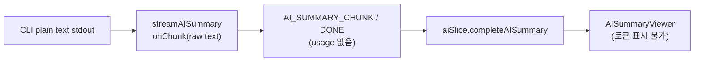
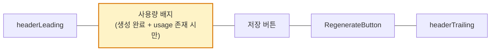
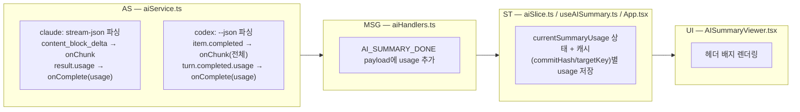

# Plan: F05b AI 요약 토큰 사용량 표시

> 이 문서는 임시 계획서다. 구현 완료 후 변경된 내용만 관련 spec/blueprint/project/core 문서에 반영하고 이 파일은 폐기한다. ([문서 작성 가이드](../project/documentation_guidelines.md) 참고)
>
> 이 파일은 완료 전까지 유일한 정본(single source of truth)이다. 다른 세션에서 이어받을 때는 이 문서 전체를 먼저 읽고, 상태와 체크박스만 보고 무엇이 끝났고 무엇이 남았는지 판단한다 — 별도 진행 상황 문서를 만들지 않는다.

## 상태

| 항목 | 값 |
|---|---|
| 단계 | 구현 완료 |
| 마지막 갱신 | 2026-07-20 |
| 구현 진행률 | 6 / 6 ("9. 구현 순서 제안" 참고) |
| 미결 Open Questions | 0 / 0 |

---

## 1. 배경 및 목표

F05b 커밋/파일 단위 AI 요약은 CLI를 plain text 모드로 실행해 stdout을 그대로 청크로 흘려보낸다. 이 방식에는 토큰/비용 정보가 전혀 없다. 이 계획은 Claude/Codex CLI를 JSON 계열 출력 모드로 전환해, 생성 완료 시 입력/출력 토�큰 수(가능하면 비용)를 함께 받아 `AISummaryViewer` 헤더에 표시한다.

실제 CLI를 직접 호출해 확인한 결과:

- **Claude** (`-p --output-format stream-json --include-partial-messages --verbose`): 텍스트가 `content_block_delta` 이벤트로 조각조각 오고(기존 실시간 타이핑 효과 유지 가능), 마지막 `type: "result"` 이벤트에 `usage.input_tokens`/`usage.output_tokens`/`total_cost_usd`가 포함됨.
- **Codex** (`exec --json`): `turn.completed` 이벤트에 `usage.input_tokens`/`usage.output_tokens`(+`cached_input_tokens`/`reasoning_output_tokens`, 비용 필드 없음)가 포함되지만, 텍스트는 `item.completed` 이벤트 하나에 전체 응답이 한 번에 담겨 온다 — JSON 모드로 바꾸면 실시간 타이핑 효과를 잃는다.
- **Gemini**: `--output-format json`/`stream-json` 플래그는 있으나, 이 환경 계정의 인증 문제로 실제 응답 형태를 검증하지 못함.

---

## 2. 사용자 확인 완료 사항

- Codex는 실시간 타이핑 효과를 잃는 트레이드오프를 감수하고 토큰 표시를 적용한다(응답이 한 번에 도착하면 그 전체 텍스트를 단일 청크로 `onChunk` 호출 — 기존 `StreamingTextRenderer`가 그대로 렌더링).
- 토큰 사용량은 `AISummaryViewer` 헤더에 상시 표시한다(생성 완료 후, 저장/재생성 버튼 근처).
- 이번 범위는 **Claude·Codex만** 포함한다. Gemini는 실제 계정으로 JSON 출력 형태를 검증하기 전까지 기존 plain text 모드를 유지하고 토큰 배지를 표시하지 않는다(후속 작업).
- 범위는 커밋/파일 단위 AI 요약(F05b)으로 한정한다. F09 Q&A(`AI_QA_COMPLETE`)는 이번에 배지를 달지 않는다 — `streamAISummary`의 `onComplete`가 항상 usage를 반환하도록 바뀌므로 QA 호출부도 값은 받지만 메시지 payload에 싣지 않는다(향후 필요 시 쉽게 확장 가능).
- 토큰 사용량은 세션 내 표시 전용이며 저장되는 `.ai.md` 노트 파일 내용에는 포함하지 않는다(저장본을 다시 불러왔을 때는 배지가 나타나지 않는 것이 정상 동작).

---

## 3. 현재 구조 요약

- `getProviderCommand` ([aiService.ts:129](../../src/extension/aiService.ts#L129)) — provider별 CLI 인자를 만들지만 출력 형식은 모두 plain text.
- `streamAISummary` ([aiService.ts:16](../../src/extension/aiService.ts#L16)) — `process.stdout`의 각 `data` 이벤트를 그대로 `onChunk(data.toString())`으로 전달. `onComplete: () => void`는 인자를 받지 않음.
- `handleStartAISummaryCommit`/`handleStartAISummaryFile`/`handleStartAIQA` ([aiHandlers.ts](../../src/extension/messageHandler/aiHandlers.ts)) — 세 곳 모두 동일한 `onChunk`/`onComplete` 패턴으로 `AI_SUMMARY_CHUNK`/`AI_SUMMARY_DONE`, `AI_QA_CHUNK`/`AI_QA_COMPLETE`를 postMessage.
- `App.tsx`가 `AI_SUMMARY_DONE`을 받아 `completeAISummary()`(aiSlice.ts) 호출, `useAISummary.ts`가 `AI_QA_COMPLETE`를 받아 `completeAIQA()` 호출.
- `AISummaryViewerProps` ([AISummaryViewer.tsx](../../src/webview/features/F05b/AISummaryViewer.tsx)) 헤더는 왼쪽 `headerLeading`, 오른쪽에 저장 버튼 → `RegenerateButton` → `headerTrailing` 순으로 배치.
- 토큰/비용 정보는 어디에도 없음.

---

## 4. 신규 구조

### 4.1 정보 구조

- 신규 타입 `AIUsageInfo { inputTokens: number; outputTokens: number; costUsd: number | null }` — `src/extension/aiTypes.ts`에 추가, 웹뷰 쪽은 동일 shape을 `src/webview/types/commit.ts`(또는 기존 AI 관련 타입 위치)에 미러링.
- `StreamAISummaryOptions.onComplete` 시그니처를 `(usage: AIUsageInfo | null) => void`로 변경.
- `streamAISummary` 내부에 provider별 stdout 처리 분기:
  - **claude**: NDJSON 라인 버퍼링(청크가 줄 중간에서 끊길 수 있으므로 `\n` 기준으로 완결된 라인만 처리) → `type: "stream_event", event: { type: "content_block_delta", delta: { type: "text_delta", text } }`이면 `onChunk(text)` → `type: "result"`이면 `usage = { inputTokens: usage.input_tokens, outputTokens: usage.output_tokens, costUsd: total_cost_usd ?? null }`를 저장해두었다가 `close` 시 `onComplete(usage)`
  - **codex**: 동일하게 라인 버퍼링 → `type: "item.completed", item: { type: "agent_message", text }`이면 `onChunk(text)`(전체 텍스트가 한 번에 옴) → `type: "turn.completed"`이면 `usage = { inputTokens: usage.input_tokens, outputTokens: usage.output_tokens, costUsd: null }`
  - **gemini**: 기존 그대로 plain text passthrough, `onComplete(null)`
  - 파싱 실패(JSON이 아니거나 예상 밖 shape)한 라인은 텍스트로 화면에 흘리지 않고 조용히 무시한다(JSON 조각이 마크다운에 섞여 보이는 것을 방지) — CLI 실패 자체는 기존처럼 `stderr`/`close(code !== 0)` 경로로 처리되므로 파싱 실패가 곧 오류는 아님.
- `getProviderCommand` 변경:
  - `claude`: 기존 인자에 `--output-format`, `stream-json`, `--include-partial-messages`, `--verbose` 추가 (실제 호출로 `--verbose` 없이는 `--output-format=stream-json`이 에러남을 확인함)
  - `codex`: `exec --skip-git-repo-check [...model] --json -` (`--json` 추가)
  - `gemini`: 변경 없음

### 4.2 레이아웃 (헤더 배지 위치)

> 배지 표기: `{inputTokens.toLocaleString()} in · {outputTokens.toLocaleString()} out`, `costUsd`가 있으면 뒤에 ` · $x.xxxx` 추가. `isGenerating`이거나 `usage`가 없으면(저장본을 불러온 경우, Gemini) 배지를 렌더링하지 않는다.

### 4.3 파이프라인 (AS → MSG → ST → UI)

---

## 5. 상태 관리 / 데이터 변경안

- `aiSlice.ts`: `currentSummaryUsage: AIUsageInfo | null` 신규 필드. `completeAISummary` 인자에 `usage?: AIUsageInfo | null` 추가해 상태에 반영하고, `completedSummaryCache[commitHash]`/`summaryViewCache[targetKey]` 각 엔트리 shape에 `usage: AIUsageInfo | null`을 추가한다.
- `startAISummaryLoading`/`startAISummaryGeneration`/`resetAISummary`에서 `currentSummaryUsage: null`로 초기화(새 생성 시작 시 이전 배지가 남아있지 않도록).
- `useAISummary.ts`: `displayedUsage`를 기존 `displayedSummaryContent`와 동일한 "활성 타깃이면 현재 상태, 아니면 캐시" 패턴으로 계산해 반환값에 `usage: AIUsageInfo | null` 추가.
- `App.tsx`: `AI_SUMMARY_DONE` 핸들러에서 `usage: event.data.payload?.usage ?? null`을 `completeAISummary` 호출에 전달.
- `AI_SUMMARY_LOADED`(저장본 즉시 로드)는 `usage`를 다루지 않는다 — 로드 시 `currentSummaryUsage`는 자연히 `null`로 유지된다.

---

## 6. 변경 내역 — 청사진 매핑

### AS — aiService.ts / aiTypes.ts

- `aiTypes.ts`: `AIUsageInfo` 타입 추가
- `aiService.ts`: `getProviderCommand`에 claude/codex JSON 출력 플래그 추가, `streamAISummary` 내부에 provider별 NDJSON 파서 추가, `StreamAISummaryOptions.onComplete` 시그니처 변경

### MSG — aiHandlers.ts

- `handleStartAISummaryCommit`/`handleStartAISummaryFile`의 `onComplete: (usage) => {...}`에서 `AI_SUMMARY_DONE` payload에 `usage` 포함
- `handleStartAIQA`의 `onComplete`는 시그니처 변경에 맞춰 `(usage) => {...}`로 받되 `AI_QA_COMPLETE` payload에는 싣지 않음(스코프 아웃)

### ST — aiSlice.ts / useAISummary.ts / App.tsx

- `aiSlice.ts`: `currentSummaryUsage` 상태, `completeAISummary` 시그니처·캐시 shape 변경, 초기화 지점에 `null` 리셋 추가
- `useAISummary.ts`: `displayedUsage` 계산 및 반환값에 `usage` 추가
- `App.tsx`: `AI_SUMMARY_DONE` 메시지 타입 정의 및 핸들러에 `usage` 전달 추가

### UI — AISummaryViewer.tsx / AISummaryPanel.tsx

- `AISummaryViewerProps`에 `usage: AIUsageInfo | null` 추가, 헤더 오른쪽 영역(저장 버튼 앞)에 배지 렌더링, `isGenerating || !usage`면 렌더링 생략
- `AISummaryPanel.tsx`: `useAISummary()` 결과의 `usage`를 `AISummaryViewer`로 그대로 전달(기존 다른 prop들과 동일한 패턴)

---

## 7. 문서 갱신 대상

| 문서 | 태그 | 갱신 내용 |
|---|---|---|
| `docs/features/F05b_ai_summary_commit/spec.md` | AS, MSG | Business Rules에 "토큰 사용량 표시" 행 추가(Claude·Codex만 지원, Gemini 미지원 명시) |
| `docs/features/F05b_ai_summary_commit/blueprint.md` | UI | `AISummaryViewerProps`에 `usage` 추가, Layout Rules에 배지 위치 반영 |

---

## 8. Open Questions

없음 — 논의 과정에서 전부 해소됨.

---

## 9. 구현 순서 제안

- [x] AS-1. `aiTypes.ts`에 `AIUsageInfo` 추가, `aiService.ts`의 `getProviderCommand`에 claude/codex JSON 출력 플래그 반영 + 단위 테스트 갱신(`tests/unit/aiService.test.ts`)
- [x] AS-2. `streamAISummary`에 provider별 NDJSON 파서(claude/codex) 구현, `onComplete(usage)` 시그니처 변경 + 단위 테스트(라인 분할 케이스, 파싱 실패 무시 케이스 포함)
- [x] MSG-1. `aiHandlers.ts` 세 호출부의 `onComplete` 갱신, `AI_SUMMARY_DONE` payload에 `usage` 포함
- [x] ST-1. `aiSlice.ts`/`useAISummary.ts`/`App.tsx`에 `usage` 상태·전달 배선
- [x] UI-1. `AISummaryViewer.tsx` 헤더 배지 + `AISummaryPanel.tsx` prop 전달
- [x] 공통-1. `pnpm typecheck && pnpm lint && pnpm test` 통과 확인, F05b spec.md/blueprint.md 반영 (7절 대상)

---

## 10. 수동 검증 체크리스트

- [ ] AS. Claude로 커밋 요약 생성 → 실시간 타이핑 효과가 그대로 동작하는지, 완료 후 배지에 입력/출력 토큰·비용이 표시되는지 확인
- [ ] AS. Codex로 커밋 요약 생성 → 텍스트가 한 번에 표시되더라도 오류 없이 렌더링되고, 완료 후 배지에 토큰 수가 표시되는지(비용은 표시 안 됨) 확인
- [ ] AS. Gemini로 커밋 요약 생성 → 기존과 동일하게 plain text로 정상 동작하고 배지가 나타나지 않는지 확인
- [ ] ST/UI. 저장된 노트를 다시 불러왔을 때 배지가 나타나지 않는지 확인
- [ ] ST/UI. 커밋 요약 → 다른 커밋으로 전환 → 다시 돌아왔을 때 캐시된 usage가 올바르게 다시 표시되는지 확인
