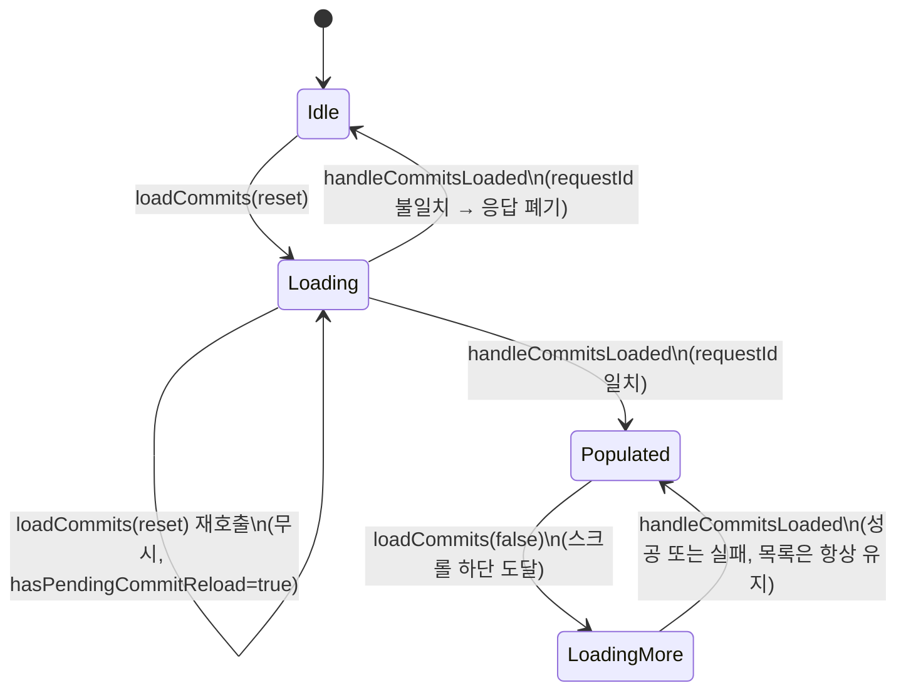
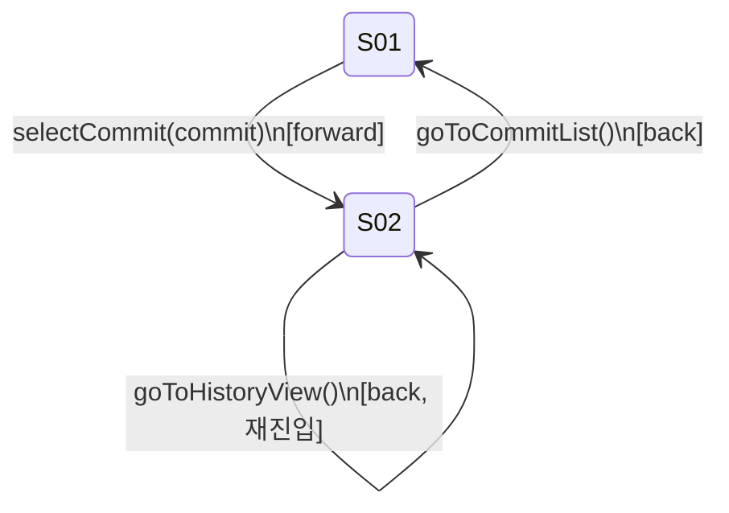
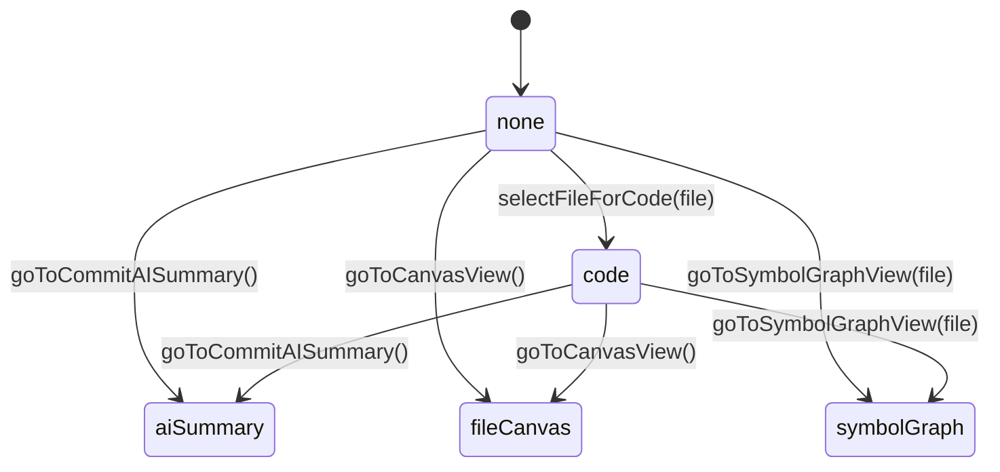
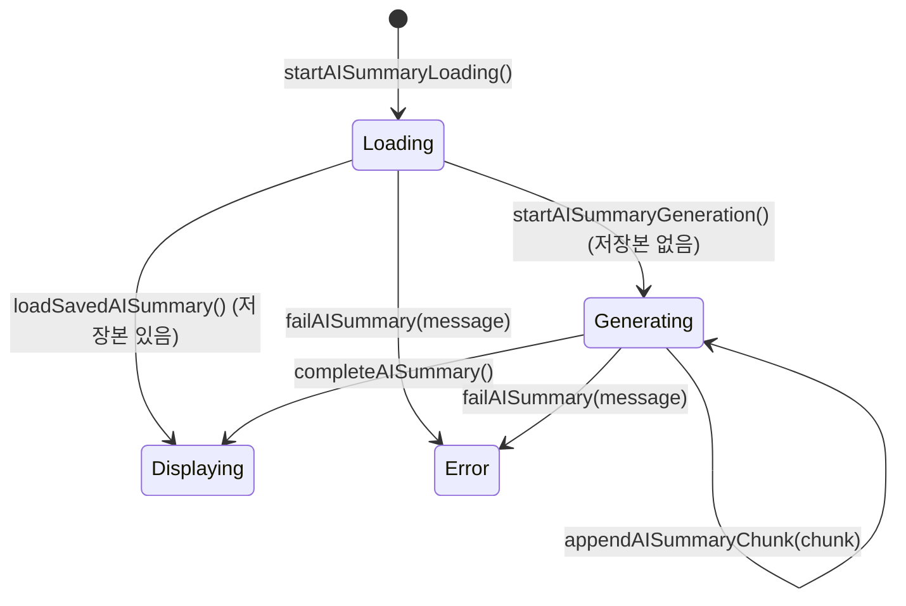
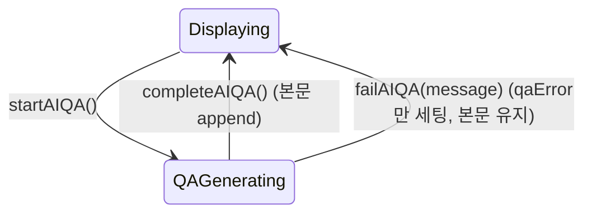

# State Management — GitChronicle

> **버전** v1.0 | **작성일** 2026-06-26 | **상태** 확정

---

## 개요

GitChronicle의 상태는 두 레이어에 분리하여 관리한다.

| 레이어 | 상태 종류 | 저장소 |
|--------|-----------|--------|
| Webview (React) | UI 전역 상태 | Zustand 단일 스토어 (`useAppStore`) |
| Webview State | 웹뷰 재생성 후 복원할 최소 UI 상태 | VSCode `acquireVsCodeApi().getState()` / `setState()` |
| Extension Host | 설정 영속 상태 | `registeredProviders`는 `ExtensionContext.globalState`, 프로젝트별 AI 설정은 `ExtensionContext.workspaceState` |
| 컴포넌트 로컬 | hover, 드롭다운 열림 등 UI 전용 상태 | `React.useState` |

---

## Zustand 스토어 구조

```typescript
// src/webview/store/appStore.ts

interface AppState {
  // === Navigation ===
  currentScreen: ScreenID;
  previousScreen: ScreenID | null;
  transitionDirection: RouteTransitionDirection;

  // === Git Repository ===
  isGitRepoDetected: boolean;

  // === Commit ===
  commitList: Commit[];
  selectedCommit: Commit | null;
  isLoadingCommits: boolean;
  hasMoreCommits: boolean;
  commitPage: number;
  lastRequestId: number;
  pendingRequestId: number | null;
  hasPendingCommitReload: boolean;
  commitLoadError: string | null;
  loadMoreError: string | null;
  hasLoadedCommits: boolean;

  // === Filter ===
  filterDateStart: string | null;
  filterDateEnd: string | null;
  filterAuthor: string | null;
  filterKeyword: string;
  filterExcludeKeyword: string;
  sortOrder: 'desc' | 'asc';
  authorList: string[];

  // === File ===
  changedFiles: ChangedFile[];
  hasSavedCommitSummary: boolean;
  selectedFile: ChangedFile | null;
  isLoadingChangedFiles: boolean;
  changedFilesError: string | null;

  // === Dependency Canvas (F04, S05) ===
  dependencyEdges: DependencyEdge[];
  isLoadingDependencies: boolean;
  dependenciesError: string | null;

  // === Symbol Graph (F10, S08) ===
  selectedFileForSymbolGraph: ChangedFile | null;
  symbolNodes: SymbolNode[];
  symbolEdges: SymbolEdge[];
  isLoadingSymbolGraph: boolean;
  symbolGraphError: string | null;
  isCodePanelOpen: boolean;
  activeSymbolNodeId: string | null;
  hoveredSymbolNodeId: string | null;

  // === AI Summary ===
  summaryModel: string | null;
  qaModel: string | null;
  currentSummaryContent: string;
  isLoadingSummary: boolean;
  isGeneratingSummary: boolean;
  isGeneratingQA: boolean;
  summaryError: string | null;
  qaError: string | null;
  summarySavedPath: string | null;
  hasCurrentSavedSummary: boolean;
  isSummaryTokenLimitExceeded: boolean;

  // === Toast ===
  toasts: ToastItem[];

  // === AI Providers ===
  activeAIProvider: AIProviderName | null;
  registeredProviders: AIProviderName[];

  // === Save Path ===
  savePath: string | null;

  // === Actions ===
  loadCommits: (reset?: boolean) => void;
  loadChangedFiles: () => void;
  handleCommitsLoaded: (payload: { commits: Commit[]; page: number; pageSize: number; hasMore?: boolean; requestId?: number }) => void;
  handleRepositoryNotFound: () => void;
  handleCommitsLoadFailed: (message?: string) => void;
  selectCommit: (commit: Commit) => void;
  goToCommitList: () => void;
  goToHistoryView: () => void;
  goBackFromDetail: () => void;
  setFilter: (filter: Partial<FilterState>) => void;
  clearFilters: () => void;
  openRepository: () => void;
  selectFileForCode: (file: ChangedFile) => void;
  goToCommitAISummary: () => void;
  goToCanvasView: () => void;
  goToSymbolGraphView: (file: ChangedFile) => void;
  loadSymbolGraph: () => void;
  handleSymbolGraphLoaded: (nodes: SymbolNode[], edges: SymbolEdge[]) => void;
  handleSymbolGraphLoadFailed: (message?: string) => void;
  goToSettingsView: () => void;
  pushToast: (message: string, type: ToastType) => void;
  dismissToast: (id: string) => void;
  handleChangedFilesLoaded: (payload: { files: ChangedFile[]; hasSavedCommitSummary?: boolean }) => void;
  handleChangedFilesLoadFailed: (message?: string) => void;
  setAISummarySettings: (settings: { savePath?: string | null; registeredProviders?: AIProviderName[]; activeAIProvider?: AIProviderName | null; summaryModel?: string | null; qaModel?: string | null }) => void;
  resetAISummary: () => void;
  startAISummaryLoading: () => void;
  startAISummaryGeneration: () => void;
  appendAISummaryChunk: (chunk: string) => void;
  completeAISummary: (payload: { content?: string; savedPath?: string | null; provider?: AIProviderName | null }) => void;
  loadSavedAISummary: (payload: { content: string; savedPath?: string | null; provider?: AIProviderName | null }) => void;
  failAISummary: (message?: string) => void;
  startAIQA: () => void;
  completeAIQA: (payload: { appendedContent: string }) => void;
  failAIQA: (message?: string) => void;
  setSummaryTokenWarning: (isOverLimit: boolean) => void;
}
```

---

## 액션 정의 및 부수 효과

### loadCommits / handleCommitsLoaded



- `requestId`는 응답 순서를 보장하기 위한 값이다. 필터를 빠르게 연속 변경하면 이전 요청의 응답이 늦게 도착할 수 있는데, 오래된 `requestId`의 응답이 최신 필터 결과를 덮어쓰지 않도록 폐기한다.
- `hasMoreCommits`는 Extension Host가 내려주는 `hasMore` 값을 우선 사용하고, 없을 때만 `commits.length >= pageSize`로 추정한다.

### setFilter / clearFilters

| 액션 | 트리거 | 부수효과 |
|------|--------|----------|
| `setFilter(filter)` | 필터 값 변경 | 상태 병합 → Webview State에 `{ filter }`만 저장(목록·로딩 상태는 저장 안 함) → `loadCommits(true)` |
| `clearFilters()` | 필터 초기화 | `DEFAULT_FILTER_STATE`로 리셋 → Webview State 저장 → `loadCommits(true)` |

- `S01_CommitListScreen`은 active route slot이 될 때 `loadCommits(true)`를 호출한다. 웹뷰가 숨김 상태에서 파괴되었다가 다시 생성되어도 저장된 `{ filter }`가 먼저 복원되므로, 재로드 요청은 복원된 필터 조건을 사용한다.
- 정렬 순서가 `asc`일 때는 Extension Host가 전체 커밋 수를 먼저 계산한 뒤 역산된 페이지 오프셋으로 오래된 순 목록을 가져와 응답한다 — 최신순과 달리 "끝에서부터 세는" 방식이라 전체 카운트가 선행되어야 한다.

---

### 화면 전환 상태

화면 전환은 `currentScreen`, `previousScreen`, `transitionDirection` 세 필드로 관리한다.

| 상태 | 설명 |
|------|------|
| `currentScreen` | 현재 active 화면 |
| `previousScreen` | 현재는 S06에서 뒤로가기 대상 화면을 기억하는 용도로만 사용한다. |
| `transitionDirection` | 라우트 전환 애니메이션 방향. `'forward'` 또는 `'back'` |
| `activeWorkspacePanel` | S02 워크스페이스 본문 패널 상태. `'none' | 'code' | 'aiSummary' | 'fileCanvas' | 'symbolGraph'` |

`App.tsx`는 `transitionDirection`을 읽어 incoming/outgoing 라우트 슬롯에 CSS animation class를 적용한다. `transitionDirection`은 화면 전환 동작의 시각적 방향만 표현하며, 데이터 로딩 상태를 직접 변경하지 않는다.

### selectCommit



이전 커밋 조회 시점의 잔여 상태가 새 커밋에 섞이지 않도록, `selectCommit`은 화면 전환과 함께 아래 필드를 초기화한다.

| 초기화되는 상태 | 소속 Feature |
|------|------|
| `selectedFile`, `changedFiles`, `changedFilesError`, `isLoadingChangedFiles` | F02 |
| `dependencyEdges`, `dependenciesError` | F04 |
| `currentSummaryContent`, `isLoadingSummary`, `isGeneratingSummary`, `summaryError`, `summarySavedPath`, `hasCurrentSavedSummary`, `isSummaryTokenLimitExceeded`, `hasSavedCommitSummary` | F05b |

### loadChangedFiles / handleChangedFilesLoaded

| 액션 | 가드 | 부수효과 |
|------|------|----------|
| `loadChangedFiles()` | `selectedCommit`이 있고 중복 로딩 중이 아닐 때만 실행 | `isLoadingChangedFiles = true` → `FETCH_CHANGED_FILES` 전송 |
| `handleChangedFilesLoaded(files)` | 응답 수신 | `changedFiles` 교체, 로딩/에러 상태 해제 |

### S02 워크스페이스 패널 전환 액션



- `goToSettingsView()`는 위 다이어그램과 별개로 S01/S02에서 S06으로 진입 가능하며, 진입 시점의 `currentScreen`을 `previousScreen`에 저장한다.
- `selectFileForCode`와 `goToCommitAISummary`는 이전 화면의 잔여 AI 요약 상태가 섞이지 않도록 `currentSummaryContent`, `isLoadingSummary`, `isGeneratingSummary`, `summaryError`, `summarySavedPath`, `hasCurrentSavedSummary`, `isSummaryTokenLimitExceeded`를 함께 초기화한다.
- Diff 로딩 상태(`diffLines`, `isLoading`, `error`, `isBinaryFile`, `isDeletedFile`)는 S02 내부의 `useFileDiff()` 로컬 상태로 관리한다.
- 의존성 캔버스는 전역 상태의 `dependencyEdges`, `isLoadingDependencies`, `dependenciesError`를 사용하며, S02의 `activeWorkspacePanel === "fileCanvas"`일 때만 로드를 트리거한다.

전환 애니메이션 중 outgoing 화면도 잠시 mount되므로, 각 최상위 화면은 `shared/route/RouteSlotContext.tsx`의 `useRouteSlotActive()`를 확인한다. inactive 슬롯에서는 초기 데이터 로딩 effect와 Extension 메시지 listener를 실행하지 않는다.

### F05b AI 정리 액션

S04 커밋 단위 AI 정리 화면은 전역 상태로 저장본 로딩, AI 생성, 스트리밍 청크, 저장 완료, 에러 상태를 구분한다. Extension Host 메시지는 `features/F05b/S04_AISummaryViewerScreen.tsx`에서 직접 구독한다.





- `setAISummarySettings(...)`는 전달된 필드만 부분 병합한다(`savePath`/`registeredProviders`/`activeAIProvider`/`summaryModel`/`qaModel`).
- `completeAISummary`는 `hasSavedCommitSummary`도 함께 `true`로 갱신한다 — 뒤로 돌아가도 `CommitActionBar`의 `SavedBadge`가 별도 재조회 없이 즉시 보이는 이유다.
- `setSummaryTokenWarning(isOverLimit)`은 `isSummaryTokenLimitExceeded` 플래그만 갱신하며 위 상태 기계와 독립적으로 언제든 호출될 수 있다.

S04 진입 시 `FETCH_AI_SUMMARY_SETTINGS`로 Extension Host의 `globalState` 설정값을 먼저 복원하고, `activeAIProvider`와 `savePath`가 모두 있으면 `START_AI_SUMMARY_COMMIT`을 보낸다. 설정 응답에는 `savePath`, `registeredProviders`, `activeAIProvider`, `summaryModel`, `qaModel`이 포함된다.

AI 응답 완료 후 저장 디렉토리 생성 또는 파일 쓰기에 실패하면 Extension Host는 `AI_SUMMARY_ERROR`를 보내고, Webview는 `failAISummary()`로 `summaryError = "저장 경로를 생성할 수 없습니다. 권한을 확인하세요"`를 표시한다. 저장 경로가 미설정된 경우에는 S04의 `EmptyState`가 "저장 경로를 먼저 설정해주세요"와 "설정으로 이동" CTA를 보여준다.

요약이 완료된 뒤 사용자가 질문을 입력하면 `START_AI_QA`가 전송된다. Extension Host는 활성 프로바이더의 `qaModel`로 응답을 생성하고, `AI_QA_CHUNK` / `AI_QA_COMPLETE` / `AI_QA_ERROR` 메시지로 상태를 전달한다. 완료 시 `currentSummaryContent`와 저장된 `.md` 파일이 동시에 갱신된다.

### F06/F07 설정 액션

F06 구현은 `REGISTER_AI_PROVIDER`로 CLI 버전 확인과 등록을 요청하고, 등록된 제공자는 `ACTIVATE_AI_PROVIDER`로 활성/비활성을 토글한다. 하나를 활성화하면 나머지는 자동으로 비활성 상태가 되며, 활성 버튼 하단에는 요약용/Q&A용 모델 드롭다운이 노출된다. F05b는 `FETCH_AI_SUMMARY_SETTINGS` 응답의 `registeredProviders`, `activeAIProvider`, `savePath`, `summaryModel`, `qaModel`을 `setAISummarySettings`에 반영한다.

모델 드롭다운 변경은 `SET_AI_MODEL` 메시지로 전달되며, Host는 `AI_MODEL_UPDATED` 응답으로 현재 활성 프로바이더의 `summaryModel`, `qaModel`을 다시 내려준다.

F07 저장 경로 설정은 S06에서 `SET_SAVE_PATH` / `CLEAR_SAVE_PATH` 메시지로 Extension Host에 요청한다. 경로 선택은 `vscode.window.showOpenDialog({ canSelectFolders: true })`로 처리하며, 선택/삭제 결과는 `SAVE_PATH_SET` / `SAVE_PATH_CLEARED` 응답으로 Webview에 전달된다.

브라우저 dev fallback에서는 VSCode API가 없으므로 실제 파일 다이얼로그를 열지 않고 데모 저장 경로를 설정한다. 실제 경로 선택 다이얼로그는 Extension Host 런타임에서만 동작한다.

---

## ExtensionContext Memento (영속 설정)

Extension Host 재시작 후에도 유지해야 하는 설정은 F06/F07 구현에서 `ExtensionContext.globalState`와 `ExtensionContext.workspaceState`로 나누어 저장한다. `loadAISettingsState()`는 CLI 등록 정보만 `globalState`에서 읽고, 프로젝트별 설정은 `workspaceState`를 우선 사용한다. VSCode configuration의 `gitChronicle.savePath`, `gitChronicle.activeAIProvider`는 `workspaceState`가 비어 있을 때만 fallback으로 읽는다.

| 키 | 타입 | 설명 |
|---|------|------|
| `gitChronicle.registeredProviders` | `AIProviderName[]` | 등록된 AI CLI 목록 |
| `gitChronicle.activeAIProvider` | `AIProviderName \| undefined` | 현재 워크스페이스의 활성화된 AI CLI |
| `gitChronicle.savePath` | `string \| undefined` | 현재 워크스페이스의 AI 정리 저장 경로 |
| `gitRewind.summaryModelPerProvider` | `Record<AIProviderName, string>` | 현재 워크스페이스의 provider별 요약용 모델 |
| `gitRewind.qaModelPerProvider` | `Record<AIProviderName, string>` | 현재 워크스페이스의 provider별 Q&A용 모델 |

저장소 구분은 다음과 같다.

| 저장소 | 키 |
|---|---|
| `globalState` | `gitChronicle.registeredProviders` |
| `workspaceState` | `gitChronicle.activeAIProvider`, `gitChronicle.savePath`, `gitRewind.summaryModelPerProvider`, `gitRewind.qaModelPerProvider` |

Extension 활성화 시 이 값을 읽어 Webview에 초기 상태로 전달한다.

---

## VSCode Webview State (UI 상태 복원)

VSCode WebviewPanel은 `retainContextWhenHidden`을 설정하지 않으면 패널이 보이지 않을 때 HTML/JS 런타임이 파괴될 수 있다. 이 프로젝트는 메모리 비용이 큰 `retainContextWhenHidden: true`를 사용하지 않고, VSCode가 제공하는 `getState()` / `setState()`로 복원해야 할 UI 상태만 저장한다.

현재 Webview State에 저장하는 값은 S01 필터뿐이다.

| 키 | 타입 | 설명 |
|----|------|------|
| `filter.filterDateStart` | `string \| null` | 커밋 기간 시작일 |
| `filter.filterDateEnd` | `string \| null` | 커밋 기간 종료일 |
| `filter.filterAuthor` | `string \| null` | 작성자 필터 |
| `filter.filterKeyword` | `string` | 커밋 메시지 포함 키워드 |
| `filter.filterExcludeKeyword` | `string` | 커밋 메시지 제외 키워드 |
| `filter.sortOrder` | `'desc' \| 'asc'` | 커밋 목록 정렬 순서 |

커밋 목록 로딩과 관련해 아래 상태는 Webview State가 아니라 메모리 상태로만 유지한다.

| 항목 | 이유 |
|------|------|
| `lastRequestId` | 최신 요청 식별 |
| `pendingRequestId` | 응답 순서 검증 |
| `hasPendingCommitReload` | 로딩 중 필터 변경 재시도 |

저장하지 않는 항목은 의도적으로 재로드한다.

| 항목 | 이유 |
|------|------|
| `commitList` | 패널 재활성화 시 최신 Git 데이터를 다시 가져온다 |
| `selectedCommit` / `selectedFile` | 웹뷰 재생성 후에는 S01에서 다시 탐색을 시작한다 |
| 로딩/에러 상태 | 이전 런타임의 비동기 상태를 새 런타임에 이어받지 않는다 |
| AI 정리 스트리밍 상태 | Extension Host 이벤트와 화면 진입 흐름에서 다시 결정한다 |

검증 기준은 다음과 같다.

| 시나리오 | 기대 결과 |
|----------|-----------|
| S01 필터 적용 → S02 이동 → 뒤로가기 | 필터 상태 유지, 동일 조건으로 커밋 표시 |
| S01 필터 적용 → VSCode 다른 탭 전환 → 패널 복귀 | 필터 상태 복원, 복원된 조건으로 커밋 재로드 |
| S01 필터 적용 → `clearFilters` → 패널 숨김 → 복귀 | 필터 초기화 상태 유지 |
| 필터 미적용 상태에서 패널 복귀 | 필터 없이 전체 커밋 로드 |

---

## 상태 초기화 규칙

| 트리거 | 초기화 대상 |
|--------|------------|
| `selectedCommit` 변경 | `currentScreen = 'S02'`, `selectedFile`, `changedFiles`, 변경 파일 로딩/에러, 의존성 상태, AI 정리 상태 초기화 |
| `selectFileForCode` | `currentSummaryContent = ''`, `isLoadingSummary = false`, `isGeneratingSummary = false`, `summaryError = null`, `summarySavedPath = null`, `hasCurrentSavedSummary = hasSavedCommitSummary`, `isSummaryTokenLimitExceeded = false`, `currentScreen = 'S03'`, 이전 화면 저장 |
| `goToCommitAISummary` | `currentScreen = 'S04'`, AI 정리 상태 초기화. S04에서 커밋 저장본 로드 또는 커밋 전체 diff 기반 AI 정리를 시작 |
| Extension 재활성화 | `currentScreen = 'S01'`. AI/저장경로는 `globalState`에서 복원, S01 필터는 Webview State에서 복원 |
| 필터 변경 | `commitList = []`, `commitPage = 0`, `hasMoreCommits = true` → 재로드 트리거 |

---

## Selector 사용 예시

불필요한 리렌더를 방지하기 위해 필요한 상태만 선택한다.

```typescript
// 올바른 예: 필요한 상태만 선택
const selectedCommit = useAppStore((s) => s.selectedCommit);
const isLoading = useAppStore((s) => s.isLoadingCommits);

// 피해야 할 예: 전체 스토어 구독 (모든 상태 변경마다 리렌더)
const store = useAppStore();
```

---

## 관련 문서

- [architecture.md](./architecture.md)
- [coding_standards.md](./coding_standards.md)
